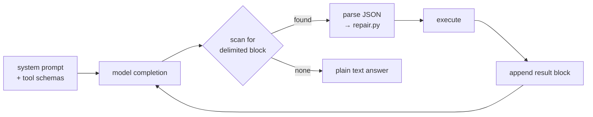

# Phase 13 — Deferred

**Effort:** — · **Depends on:** Phases 00–12 shipping

---

## 1. Why this phase exists

Every item here is something a competitor has, and every one is tempting to build early.
This document exists so that "we should add MCP" is answered with a reason rather than a
shrug — and so the reasons are written down before enthusiasm rewrites them.

The general principle: **each of these multiplies the surface area of something that is
not yet proven.** Subagents multiply the agent loop. Plugins multiply the tool registry.
Hooks multiply the lifecycle. Multiply a solid thing and you get leverage; multiply a
shaky thing and you get a support burden you cannot debug.

`docs/tools.md` puts all of them last for the same reason.

---

## 2. Text-protocol tool calling

**Unlocks:** Ollama models with no native tool-calling endpoint.

Hermes-style: inject tool schemas into the system prompt, and parse delimited blocks out
of the completion stream.

**Why this is the strongest candidate to build first.** It directly extends the
[Phase 00](phase-00-architecture.md) §2 competitive claim: a text protocol works on *any*
model that can follow a format, so "sign in with Ollama" stops being limited to the
handful of local models with native tool support.

The cost is parsing fragility — which [Phase 05](phase-05-tool-engine.md) already
absorbs. `repair_json` was built for exactly this shape of input.

**Trigger:** the first time a user asks for a model that `supports_tools` rejects.

**Design note:** native when available, text protocol as fallback, **same repair layer
behind both**. Never two parsing paths.

---

## 3. Subagents

**Unlocks:** parallel exploration of independent sub-tasks.

Deferred because [Phase 08](phase-08-langgraph.md) §7 makes the case: every handoff costs
an LLM call plus a context re-read. A supervisor delegating to two specialists is three
LLM calls minimum — most of the `roundtrips ≤ 4` budget spent on routing rather than
work.

**Phase 05's parallel batching already gives you concurrency within a turn**, without any
handoff cost. That covers most of what people actually want from subagents.

**Trigger:** evals show single-agent quality is genuinely insufficient on a named task
class — not "it would be cool."

**Design note:** when it comes, use `Send` fan-out, never a supervisor. `Send` dispatches
in one superstep, so N specialists cost one call's wall clock.

---

## 4. Hooks

**Unlocks:** user-defined behaviour at lifecycle points (pre-tool, post-tool, session
start).

Deferred because hooks are a **contract on the tool lifecycle**, and the lifecycle is not
yet stable. Publish hook points now and every future change to the engine is a breaking
change for users.

**Trigger:** the tool lifecycle has been unchanged for a full release cycle.

**Design note:** hooks that can *block* a tool are a permission system with a worse UX.
Keep them observational (log, notify, format) unless there is a clear reason not to.

---

## 5. MCP client

**Unlocks:** the existing ecosystem of MCP servers as tools.

Deferred because MCP tools arrive **without `ToolSpec`**. They have no `read_only`, no
`concurrency_safe`, no `risk`, no `budget_ms` — and those five fields are what Phases 05
and 11 run on. An MCP tool dropped into the registry is a tool the batch planner cannot
schedule and the permission policy cannot classify.

**Trigger:** Phases 05 and 11 are stable, and you have decided the mapping question below.

**Design note — the real work is the mapping:**

| `ToolSpec` field | How to derive for an MCP tool |
|---|---|
| `read_only` | MCP annotations if present; otherwise **assume false** |
| `concurrency_safe` | **Assume false.** Serial is slow; parallel is wrong |
| `risk` | **Assume `HIGH`** — an unknown remote tool prompts |
| `budget_ms` | Measure, then set |
| `timeout_s` | Hard default, always |

Every default is the conservative one. An MCP tool should have to *earn* parallelism and
auto-approval, not receive them by omission.

---

## 6. Plugins

**Unlocks:** third-party tools loaded from a directory or registry.

Deferred, and of everything here this is the one with a concrete cautionary number: a
security audit of skills published to ClawHub found **roughly 12% contained malicious
code**. Skills in that ecosystem can execute shell commands, read and write files, access
the network, and schedule cron jobs.

**Extensibility is the attack surface.** An agent that loads third-party instruction
files into its context at session start is loading untrusted instructions by design —
which is precisely the injection vector [Phase 11](phase-11-permissions.md) §6 exists to
contain.

**Trigger:** a sandboxing story exists — not before.

**Design note:** the seam is already there. `ToolRegistry.load_from_directory()` is a
small function. The hard part is not loading; it is deciding what a loaded tool is
allowed to do, and defaulting it to almost nothing.

---

## 7. Web tools

**Unlocks:** documentation lookup, package research.

Deferred on latency: ~800 ms per call, against a `turn_overhead_p95` budget of 300 ms.

More importantly, a network tool **breaks the egress-control guarantee** in
[Phase 12](phase-12-guardrails.md) §3. Right now "exfiltration needs a channel, and there
is no channel" is a free, absolute security property. A web tool spends it.

**Trigger:** a specific user need that local tools genuinely cannot serve.

**Design note:** if it ships, it is `RiskLevel.HIGH`, off by default, and the egress PII
scan becomes mandatory rather than provider-conditional.

---

## 8. Decision record

| Item | Gate to build | Priority |
|---|---|---|
| Text-protocol tool calling | first user blocked by `supports_tools` | **1 — highest** |
| MCP client | Phases 05 + 11 stable, mapping decided | 2 |
| Subagents | evals prove single-agent insufficiency | 3 |
| Hooks | lifecycle stable for one release | 4 |
| Web tools | specific unmet need | 5 |
| Plugins | sandboxing story exists | 6 — lowest |

**Revisit this table each release.** The order is a judgement about today's risks, not a
permanent ranking — but change it deliberately, with the reason written down, rather than
because something felt urgent in a planning meeting.

---

← [Previous: Phase 12 — Guardrails & PII](phase-12-guardrails.md) · [Index](README.md)
